# PRODUCT REQUIREMENT DOCUMENT (PRD) & SYSTEM SPECIFICATION
## Pemetaan & Analisis Perubahan Vegetasi Ibu Kota Nusantara (IKN)

> **Mata Kuliah**: Kapita Selekta Sistem Informasi &times; Maha Data — Universitas Bakrie  
> **Repository**: [najmakhonsa/ikn-vegetation-analysis](https://github.com/najmakhonsa/ikn-vegetation-analysis)  
> **Workspace Path**: `apps/custom-enterprise/ibukotanusantara/`  
> **Struktur Dokumen**: Comprehensive PRD, Technical Architecture, 4-Tab WebGIS Spec, Advanced ML Statistics, Enterprise Innovations & Policy Roadmap  

---

## 👥 1. Tim Peneliti & Peran (Universitas Bakrie)

| Nama Peneliti | NIM / Identitas | Peran & Tanggung Jawab Utama |
|---|---|---|
| **Najma Khonsa Tsabita** | *Kapita Selekta SI* | Ground Truth Collection & Preprocessing Citra Satelit |
| **Agnesia Nadya Tassi** | *Kapita Selekta SI* | Ground Truth Collection & Preprocessing Citra Satelit |
| **Fadel Setiawan Arifin** | *Kapita Selekta SI* | Model Training Random Forest & Evaluasi Metrik |
| **Chalimatus Sa'Diyyah** | *Kapita Selekta SI* | Model Training Random Forest & Evaluasi Metrik |
| **Muhammad Ridho Azfa Karani** | *Kapita Selekta SI* | Pengembang WebGIS Interaktif & Custom Enterprise Portal |

---

## 🎯 2. Rumusan Masalah, Visi & Tujuan Riset

### 2.1 Rumusan Masalah
> *Apakah pembangunan fisik Ibu Kota Nusantara (IKN) antara tahun 2024 dan 2026 masih konsisten mempertahankan karakter sebagai **Green Forest City**, dilihat dari analisis spasiotemporal tutupan vegetasi berbasis citra satelit Sentinel-2?*

### 2.2 Visi & Nilai Tambah Sistem
1. **Transparansi Spasial Tanpa Black-Box**: Menyediakan platform WebGIS 4-Tab interaktif di mana publik, akademisi, dan pembuat kebijakan dapat menelusuri data dari citra mentah, pemrosesan GEE, hingga prediksi model ML.
2. **Standardisasi Metodologi GEE & ML**: Menggunakan Google Earth Engine (GEE) dan algoritma `smileRandomForest` (100 Trees, Seed 42, Split 80:20) dengan presisi cloud masking berbasis Scene Classification Layer (SCL).
3. **Analisis Statistik Lanjutan**: Dilengkapi dengan pengujian keandalan model formal (Wilson Score 95% CI, Uji McNemar, Dekomposisi Kappa, Specificity, NPV, MCC) dan dekomposisi dinamika perubahan (*Net vs Swap* serta *Z-Score Outlier Analysis*).
4. **Integrasi Custom Enterprise Command Center**: Menghubungkan visualisasi spasial dengan Codaxiom AI Enterprise Platform, WhatsApp Gateway EWS untuk notifikasi otomatis OIKN, GSAP video scrubbing, Split-Screen Curtain Slider, dan Kalkulator Reforestasi Karbon 2030.

---

## 🌐 3. Arsitektur WebGIS Lengkap (Spesifikasi 4 Tab Utama)

```mermaid
graph TD
    UI[WebGIS Application - 4 Tab Utama]
    UI --> Tab1[Tab 01: Peta Hasil / Map & Spatial Visualizer]
    UI --> Tab2[Tab 02: Data & Proses / Process & GEE Code Hub]
    UI --> Tab3[Tab 03: Evaluasi Model / Evaluation & Advanced Statistics]
    UI --> Tab4[Tab 4: Insight Hasil / Insights, Calculator & WA Alert]

    Tab1 --> T1_1[Peta Interaktif Leaflet / CartoDB Light & Satellite]
    Tab1 --> T1_2[5 Layer Control: 2024, 2026, Gain, Loss, Delineasi IKN]
    Tab1 --> T1_3[Ringkasan KPI Banner: Total 257.227,6 ha & Net +9.171,88 ha]

    Tab2 --> T2_1[Sumber Citra: COPERNICUS/S2_SR_HARMONIZED & SCL Masking]
    Tab2 --> T2_2[10-Step Interactive Pipeline Stream & Feature Stack]
    Tab2 --> T2_3[Skrip Lengkap GEE dengan 1-Click Copy Code Button]
    Tab2 --> T2_4[Pusat Unduh 13 Berkas Data: GeoJSON, CSV, JSON, SHP]

    Tab3 --> T3_1[Tabel Confusion Matrix 2x2 Data Testing n=77]
    Tab3 --> T3_2[Metrik Utama: Accuracy 94,81%, Kappa 0,8955, F1 0,9524]
    Tab3 --> T3_3[Metrik Turunan: Specificity, NPV, FPR, FNR, Balanced Acc, MCC]
    Tab3 --> T3_4[Uji McNemar, Wilson Score 95% CI, & Diagnostik Error]

    Tab4 --> T4_1[Analisis Spasial Gain +29.782,80 ha vs Loss -20.610,92 ha]
    Tab4 --> T4_2[Dekomposisi Dynamics Net 18,2% vs Swap 81,8%]
    Tab4 --> T4_3[Kalkulator Proyeksi Reforestasi & Sekuestrasi Karbon 2030]
    Tab4 --> T4_4[OpenClaw WhatsApp Business Gateway EWS Alert Simulator]
```



---

### 3.1 Tab 01: Peta Hasil (*Map & Spatial Visualizer*)

* **Elemen Peta**: Center di IKN KIPP (`-0.965`, `116.70`), Leaflet JS engine dengan opsi Basemap CartoDB Light & Esri Satellite.
* **5 Layer Control Interaktif**:
  - Delineasi Batas IKN (Kawasan Inti 5K, BWP 50K, AOI 250K).
  - Tutupan Vegetasi April 2024 (Hijau Tua / Baseline).
  - Tutupan Vegetasi April 2026 (Hijau Emerald / Peta Prediksi ML).
  - Peta Perubahan *Gain* (+29.782,80 ha / 717 Poligon - Cyan/Teal).
  - Peta Perubahan *Loss* (-20.610,92 ha / 242 Poligon - Merah/Coral).
* **Opacity Control**: Slider dinamis `0% – 100%` untuk setiap layer independen.
* **Fitur Reset Tampilan Peta**: Tombol *Reset Tampilan Peta (Reset Bounds)* melayang di atas peta dan pada panel kontrol sidebar untuk memulihkan cakupan pandang (*camera bounds*) IKN secara instan bila pengguna terlalu jauh melakukan *zoom in/out*.
* **Popup Info Spasial**: Informasi atribut poligon (Kategori, Luas ha, Tahun, Kategori Perubahan) saat diklik.
* **KPI Metric Banner Banner**:
  - Total Luas Wilayah AOI: `257.227,6 ha`
  - Vegetasi April 2024: `184.795,31 ha` (71,84%)
  - Vegetasi April 2026: `193.967,19 ha` (75,40% terkover)
  - Net Change: `+9.171,88 ha` (+4,96%)
  - Penambahan Vegetasi (Gain): `+29.782,80 ha` (717 Poligon)
  - Kehilangan Vegetasi (Loss): `-20.610,92 ha` (242 Poligon)
* **Peringkat Prioritas Penanganan per Zona**:
  1. *Kawasan Inti Pusat Pemerintahan (KIPP)* (Prioritas Utama: Pembukaan lahan konstruksi fisik)
  2. *Zona Penyangga Utama BWP* (Prioritas Tinggi: Pengawasan alih fungsi)
  3. *Kawasan Hutan Lindung & Restorasi* (Kondisi Terjaga: Area penanaman kembali)

---

### 3.2 Tab 02: Data & Proses (*Process Transparency & GEE Code Hub*)

* **Sumber Data Citra**: `COPERNICUS/S2_SR_HARMONIZED` (Sentinel-2 Surface Reflectance).
* **Periode Citra**: Jendela April 2024 vs April 2026 (dipilih berdasarkan eksplorasi tutupan awan terendah di AOI IKN).
* **Cloud Masking**: Scene Classification Layer (SCL) piksel 3 (cloud shadow), 8 (medium prob), 9 (high prob), 10 (thin cirrus), 11 (snow/ice).
* **10-Step Interactive Pipeline Stream**:
  1. `01 Sentinel-2 & Cloud Mask`: Selection & SCL filtering.
  2. `02 Feature Stack`: B2, B3, B4, B8, B11, B12 + NDVI + NDBI.
  3. `03 Ground Truth`: 400 titik terstratifikasi (200 titik/tahun, seimbang 100 veg / 100 non-veg).
  4. `04 Split 80:20`: Random sampling terstratifikasi (`seed: 42`, 77 sampel test).
  5. `05 Random Forest`: Model `smileRandomForest(100, 42)`.
  6. `06 Model Evaluation`: Pengujian 77 sampel test.
  7. `07 Change Detection`: Raster matriks perubahan Gain/Loss/Stable.
  8. `08 Land Cover Statistics`: Agregasi statistik luas & grafik.
  9. `09 Summary & Export`: Pembuatan laporan ringkasan CSV & Drive.
  10. `10 Vector Export`: Konversi raster perubahan ke GeoJSON & Shapefile (SHP).
* **GEE Script Code Hub**: Blok kode Javascript GEE lengkap dengan tombol **1-Click Copy Code**.
* **Inventaris 13 Berkas Unduhan Data Terbuka (1-Click Download)**:
  - `Confusion_Matrix.csv` (~1 KB)
  - `Summary_Statistik_IKN_2024_2026.csv` (~1 KB)
  - `ground_truth_ikn_2024_2026.csv` (~20 KB)
  - `batas_ikn_250k.geojson` (~80 KB)
  - `kipp_delineation.geojson` (~45 KB)
  - `zone_summary.json` (~1 KB)
  - `vegetasi_2024.geojson` (~950 KB)
  - `vegetasi_2026.geojson` (~980 KB)
  - `gain_vegetasi.geojson` (~850 KB)
  - `loss_vegetasi.geojson` (~620 KB)
  - `ground_truth_points.geojson` (~60 KB)
  - `stats_ikn.json` (~1 KB)
  - `main_script.js` (~15 KB)

---

### 3.3 Tab 03: Evaluasi Model (*Model Evaluation & Advanced Statistics*)

* **Matriks Kesalahan 2x2 (Data Testing Independent, n = 77)**:

| Kelas Aktual \ Prediksi | Non-Vegetasi (Kelas 0) | Vegetasi (Kelas 1) | Total Aktual |
|---|---|---|---|
| **Non-Vegetasi (Kelas 0)** | **33** (True Negative - TN) | **4** (False Positive - FP) | **37** |
| **Vegetasi (Kelas 1)** | **0** (False Negative - FN) | **40** (True Positive - TP) | **40** |
| **Total Prediksi** | **33** | **44** | **77** |

* **Metrik Evaluasi Utama**:
  - **Overall Accuracy**: **94,81%** (73/77)
  - **Kappa Coefficient**: **0,8955** (Reliabilitas sangat tinggi)
  - **Recall (Producer's Accuracy - Vegetasi)**: **100,00%** (0 False Negative)
  - **Precision (Consumer's Accuracy - Vegetasi)**: **90,91%** (4 False Positive)
  - **F1-Score (Vegetasi)**: **0,9524**

* **Pengujian Statistik Lanjutan**:
  1. **Metrik Turunan Confusion Matrix**:
     - *Specificity*: **89,19%** ($\frac{TN}{TN + FP} = \frac{33}{37}$)
     - *Negative Predictive Value (NPV)*: **100,00%** ($\frac{TN}{TN + FN} = \frac{33}{33}$)
     - *False Positive Rate (FPR)*: **10,81%** ($\frac{FP}{FP + TN} = \frac{4}{37}$)
     - *False Negative Rate (FNR)*: **0,00%** ($\frac{FN}{FN + TP} = \frac{0}{40}$)
     - *Balanced Accuracy*: **94,59%** ($\frac{Recall + Specificity}{2}$)
     - *Matthews Correlation Coefficient (MCC)*: **0,897** (Skala -1 s/d +1, membuktikan keandalan tinggi).
  2. **Selang Kepercayaan 95% Akurasi (Wilson Score Interval)**:
     - Titik estimasi akurasi = `94,81%`, selang kepercayaan 95%: **[87,41%, 98,00%]** ($n=77$).
  3. **Uji McNemar (Simetri Kesalahan FP vs FN)**:
     - $\text{FP} = 4$, $\text{FN} = 0 \rightarrow \chi^2 = \frac{(|4 - 0| - 1)^2}{4 + 0} = \frac{9}{4} = 2,25 \le 3,841$ ($\text{Tidak signifikan pada } \alpha=0,05$).
  4. **Dekomposisi Koefisien Kappa**:
     - Observed Agreement $P_o = 94,81\%$, Expected Chance $P_e = 49,37\% \rightarrow \kappa = \frac{P_o - P_e}{1 - P_e} = 0,8955$.

* **Diagnostik Error & Keterbatasan Model**:
  - 4 sampel False Positive terjadi pada area vegetasi ringan/semak terbuka yang terklasifikasi sebagai non-vegetasi karena reflektansi tanah terbuka pada musim kering April.
  - Resolusi 10 m belum menangkap pohon tunggal individual (< 100 m²).

---

### 3.4 Tab 04: Insight Hasil (*Insights, Carbon Calculator & WA EWS Alert*)

* **Pernyataan Temuan Utama**:
  > *"Pembangunan fisik IKN antara tahun 2024 dan 2026 mencatatkan pertumbuhan vegetasi bersih (Net Growth) sebesar **+9.171,88 ha (+4,96%)**, mengonfirmasi bahwa laju penghijauan dan reforestasi di kawasan penyangga melebihi laju pembukaan lahan di koridor konstruksi KIPP, sehingga komitmen 75% Green Forest City IKN berada pada jalur yang tepat (mencapai **75,40%** tutupan vegetasi di tahun 2026)."*

* **Distribusi Spasial & Analisis Turnover (Net vs Swap)**:
  - *Kehilangan Vegetasi (-20.610,92 ha / 242 Poligon)*: Terkonsentrasi di sepanjang sumur konstruksi KIPP dan jalan tol IKN.
  - *Pertambahan Vegetasi (+29.782,80 ha / 717 Poligon)*: Mendominasi area reforestasi & revegetasi bekas lahan tambang di zona penyangga.
  - *Dekomposisi Net vs Swap*: **18,2% Net Gain** (+9.171,88 ha) vs **81,8% Swap** (41.221,84 ha fluktuasi penggantian tutupan lahan di area penyangga).

* **Peringkat Statistik Spasial per Bagian Wilayah Perencanaan (BWP)**:
  
  | Peringkat | Bagian Wilayah Perencanaan (BWP) | Reforestasi (Gain) (ha) | Kontribusi (%) |
  | :---: | :--- | :---: | :---: |
  | 1 | BWP IV (Hutan Konservasi) | 11.230,40 | 37,7% |
  | 2 | BWP II (Sentra Ekonomi) | 6.450,15 | 21,7% |
  | 3 | BWP III (Sentra Pangan) | 5.120,80 | 17,2% |
  | 4 | BWP V (Pariwisata & Jasa) | 3.820,15 | 12,8% |
  | 5 | BWP I (Kawasan Inti) | 1.845,30 | 6,2% |
  | 6 | BWP VI (Riset & Inovasi) | 1.316,00 | 4,4% |
  | **Total** | **Seluruh IKN** | **29.782,80** | **100,0%** |

  | Peringkat | Bagian Wilayah Perencanaan (BWP) | Deforestasi (Loss) (ha) | Kontribusi (%) |
  | :---: | :--- | :---: | :---: |
  | 1 | BWP I (Kawasan Inti / KIPP) | 12.450,20 | 60,4% |
  | 2 | BWP II (Sentra Ekonomi) | 3.120,40 | 15,1% |
  | 3 | BWP III (Sentra Pangan) | 2.150,10 | 10,4% |
  | 4 | BWP V (Pariwisata & Jasa) | 1.450,60 | 7,0% |
  | 5 | BWP IV (Hutan Konservasi) | 820,50 | 4,0% |
  | 6 | BWP VI (Riset & Inovasi) | 619,12 | 3,0% |
  | **Total** | **Seluruh IKN** | **20.610,92** | **100,0%** |

* **Fitur Inovasi 1: Kalkulator Proyeksi Reforestasi & Sekuestrasi Karbon 2030**:
  - Input Slider Interaktif: Target Reforestasi Tambahan (`+1.000 ha` hingga `+50.000 ha`).
  - **Formula Real-Time**:
    1. *Serapan Karbon*: $\text{CO}_2\text{e (ton/thn)} = \text{Target (ha)} \times 14,5\text{ ton CO}_2\text{e/ha/tahun}$.
    2. *Persentase Green Forest City*: $75,4\% + \left(\frac{\text{Target ha}}{257.227,6\text{ ha}}\right) \times 100\%$.
    3. *Estimasi Bibit Pohon*: $\text{Target (ha)} \times 1.100\text{ bibit/ha}$.
  - Tombol `Simpan Skenario OIKN 2030` dengan notifikasi toast.

* **Fitur Inovasi 2: Codaxiom AI WhatsApp EWS Alert Simulator**:
  - Penyiaran laporan otomatis & peringatan dini alih fungsi lahan langsung ke WhatsApp Otorita IKN berteknologi Codaxiom AI Enterprise Platform.
  - Modal simulator interaktif dengan tombol `Kirim Laporan WA EWS` yang menyimulasikan pengiriman pesan terstruktur berisi ringkasan statistik IKN, prioritas KIPP, dan link portal WebGIS.

* **Fitur Inovasi 3: Split-Screen Spatial Comparison Curtain Slider (`#komparasi`)**:
  - Slider tirai *Before vs After* interaktif dengan **100% Clip-Path Layer Architecture** (`clip-path: polygon(...)` & `-webkit-clip-path` vendor prefixing) untuk eliminasi total pergeseran piksel saat dragging.
  - Penyesuaian rasio aspek otomatis (`aspect-ratio: 8295 / 5521`) sesuai dimensi asli citra satelit Sentinel-2.
  - Layout informasi 2-kolom bersih (*Unobstructed Info Grid*) di bawah bingkai slider agar 100% tampilan citra satelit tidak tertutup kartu teks.
  - Pengendali touch drag responsif untuk perangkat mobile (`passive: false` dengan `preventDefault()` pada gesture swipe).

---

## 🔬 4. Metodologi GEE & Alur Algoritma (Technical Workflow)

```javascript
// Konfigurasi Utama Google Earth Engine (smileRandomForest)
var iknLuas = ee.FeatureCollection('projects/kapita-500202/assets/IKN_250K');
var aoi = iknLuas.geometry();

// 1. Cloud Masking SCL
function maskS2SCL(image) {
  var scl = image.select('SCL');
  var mask = scl.neq(3).and(scl.neq(8)).and(scl.neq(9))
                .and(scl.neq(10)).and(scl.neq(11));
  return image.updateMask(mask).divide(10000);
}

// 2. Ekstraksi Band & Indeks
function addIndices(image) {
  var ndvi = image.normalizedDifference(['B8', 'B4']).rename('NDVI');
  var ndbi = image.normalizedDifference(['B11', 'B8']).rename('NDBI');
  return image.addBands([ndvi, ndbi]);
}

// 3. Training Random Forest
var bands = ['B2', 'B3', 'B4', 'B8', 'B11', 'B12', 'NDVI', 'NDBI'];
var classifier = ee.Classifier.smileRandomForest(100, 42).train({
  features: trainingSample,
  classProperty: 'landcover',
  inputProperties: bands
});
```

---

## 📋 5. Rekomendasi Aksi Taktis Kebijakan Lingkungan Berbasis BWP

Berdasarkan analisis spasiotemporal tutupan vegetasi 2024–2026 per zona Bagian Wilayah Perencanaan (BWP), dirumuskan rekomendasi kebijakan spasial taktis berikut:

1. **BWP I (Kawasan Inti / KIPP): Eco-Infrastruktur & Urban Forestry**
   * *Aksi:* Wajib menerapkan standardisasi dinding hijau (*green wall*), atap hijau (*green roof*), serta penanaman koridor vegetasi pelindung di area infrastruktur KIPP untuk menekan efek *Urban Heat Island* (UHI) akibat kontribusi pembukaan lahan sebesar 60,4% total deforestasi.
2. **BWP IV (Hutan Konservasi): Perlindungan Koridor Satwa**
   * *Aksi:* Proteksi tutupan sekunder baru dan pembangunan kanopi layang penyeberangan satwa (*eco-ducts*) guna menghubungkan hutan lindung Bukit Soeharto yang terfragmentasi oleh koridor jalan tol, melestarikan wilayah penyumbang reforestasi terbesar (37,7% total gain).
3. **BWP II (Sentra Ekonomi): Greenbelt Industri & Mitigasi Erosi**
   * *Aksi:* Pembuatan sabuk hijau (*greenbelt*) pembatas menggunakan tanaman akar wangi (*Vetiver Grass*) dan bambu di sekeliling area logistik/industri untuk mereduksi polusi dan memitigasi longsoran kupasan tanah di lereng curam.
4. **BWP III (Sentra Pangan): Agroforestri & Perlindungan DAS**
   * *Aksi:* Penerapan sistem tumpang sari (*agroforestry*) tanaman pertanian lokal dengan tegakan pohon pelindung perakaran kuat guna menjaga stabilitas hidrologis Daerah Aliran Sungai (DAS) IKN dari bahaya sedimentasi lumpur.
5. **BWP V (Pariwisata & Jasa): Ekowisata Low-Impact & Restorasi Mangrove**
   * *Aksi:* Restorasi ekosistem hutan mangrove di pesisir Teluk Balikpapan serta pembatasan izin konstruksi resor fisik di sempadan sungai untuk melestarikan biota riparian dan perairan estuari.
6. **BWP VI (Riset & Teknologi): Living Labs Kehutanan Tropika**
   * *Aksi:* Pembangunan kebun botani koleksi benih lokal (ulin, kapur, meranti) sebagai laboratorium hidup (*Living Labs*) dalam pengembangan teknologi budidaya kehutanan tropika basah.

---

## ⚡ 6. Integrasi Custom Enterprise & Fitur Inovasi Terdepan

1. **Codaxiom AI Enterprise WhatsApp Gateway**: Integrasi langsung dengan infrastruktur komunikasi otomatis untuk pengiriman laporan otomatis & alert EWS.
2. **GSAP Scroll-Scrub Video Integration (`hero.mp4`)**: Pengalaman bercerita interaktif (*scrollytelling*) 100vh pinned video.
3. **Encapsulated Tenant Isolation**: Sesuai *Custom Enterprise AI Capsule Law* ([.agents/AGENTS.md](file:///c:/codaxiom/.agents/AGENTS.md#L159)), seluruh aset terisolasi penuh di bawah `apps/custom-enterprise/ibukotanusantara/`.

---

## 🏁 7. Rekomendasi Penelitian Masa Depan

1. **Integrasi Data Radar Sentinel-1 SAR**: Polarisasi VV/VH untuk menembus tutupan awan tebal di luar musim kering April.
2. **Segmentasi Objek Berbasis LiDAR / High-Res UAV**: Estimasi biomassa di atas permukaan (*Above-Ground Biomass*) dan stok karbon IKN.
3. **Analisis Deret Waktu Multi-Temporal (Monthly Time Series)**: Memantau fluktuasi musiman fenologi vegetasi secara *real-time*.
